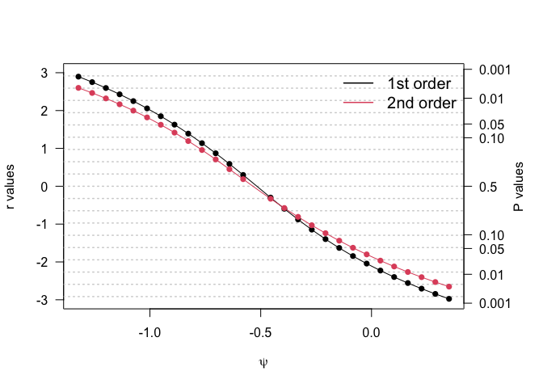

<!-- README.md is generated from README.Rmd. Please edit that file -->

# metaLik2

<!-- badges: start -->

[](https://lifecycle.r-lib.org/articles/stages.html#experimental)
[](https://github.com/giuseppealfonzetti/metaLik2/actions/workflows/R-CMD-check.yaml)
<!-- badges: end -->

The `metaLik2` provides higher order likelihood inference for
random-effects meta-analysis and meta-regression models. It leverages
the `likelihoodAsy` package to provide a modular extension to further
models than

## Installation

You can install the development version of metaLik2 like so:

``` r
pak::pkg_install("giuseppealfonzetti/metaLik2")
```

## Usage

We fit the same random-effects model to the `diuretics` data shipped
with `metaLik`, using both `metaLik()` and `metaLik2()`

``` r
library(metaLik)
library(metaLik2)
data(diuretics)

d <- metaLik2_set_data(diuretics, "continuous")
d
#> metaLik_data: continuous, 9 studies
fit <- metaLik2::metaLik2("normal_normal", d)
fit0 <- metaLik::metaLik(y ~ 1, data = diuretics, sigma2 = sigma2)
```

### A metaLik2 fit

The fit object supports `print()`, `coef()`, `vcov()` and `logLik()`
methods.

``` r
fit 
#> metaLik2 fit: normal_normal 
#> 
#> (Intercept)     log_tau2  
#>  -0.5173433   -1.4327196  
#> 
#> Heterogeneity:  tau^2 = 0.2387 
#> 
#> Log-likelihood: -9.469
coef(fit)
#> (Intercept)    log_tau2 
#>  -0.5173433  -1.4327196
vcov(fit)
#>             (Intercept)    log_tau2
#> (Intercept)  0.04263874 -0.00495638
#> log_tau2    -0.00495638  0.67407146
logLik(fit)
#> 'log Lik.' -9.468582 (df=3)

coef(fit0)
#> (Intercept) 
#>  -0.5173436
log(fit0$tau2.mle)
#> [1] -1.432674
logLik(fit0) # constant term dropped
#> 'log Lik.' -1.198135 (df=3)
```

### Hypothesis testing

Both packages test a scalar parameter using the `r` statistic or
Skovgaard’s `r*`. In `metaLik2()` computations are run via
`likelihoodAsy`

``` r
metaLik2::rstar_test(fit, PARAM = 1, ALTERNATIVE = "greater")
#> 
#> Signed profile log-likelihood ratio test for parameter (Intercept)
#> 
#> First-order statistic
#> r:-2.11, p-value:0.9826
#> Skovgaard's statistic
#> rSkov:-1.86, p-value:0.9686
#> alternative hypothesis: parameter is greater than 0
metaLik::test.metaLik(fit0, param = 1, alternative = "greater")
#> 
#> Signed profile log-likelihood ratio test for parameter (Intercept)
#> 
#> First-order statistic
#> r:-2.11, p-value:0.9826
#> Skovgaard's statistic
#> rSkov:-1.846, p-value:0.9675
#> alternative hypothesis: parameter is greater than 0
```

### Confidence intervals

Confidence intervals can be computed via `rstar_ci()`, which returns an
`rstarci` object from the `likelihoodAsy` package, with `print()`,
`summary()` and `plot()` methods.

``` r
pr <- metaLik2::rstar_ci(fit, SEED = 123)
pr
#> Confidence interval calculations based on likelihood asymptotics
#> 1st-order
#>          90%                         95%                         99%     
#> ( -0.8935  ,  -0.1415 )         ( -0.98330  ,  -0.04845 )         ( -1.1910  ,   0.1714 )
#> 2nd-order
#>          90%                         95%                         99%     
#> ( -0.95714  ,  -0.07698 )        ( -1.06111  ,   0.03794 )        ( -1.3116  ,   0.3104 )
summary(pr)
#> Confidence interval calculations based on likelihood asymptotics
#> -----------------------------------------------------------------------------
#> Parameter of interest:        User-defined function
#> Calculations based on a grid of 27 points
#> Skovgaard covariances computed with 1000 Monte Carlo draws
#> -----------------------------------------------------------------------------
#> 1st-order
#>          90%                         95%                         99%     
#> ( -0.8935  ,  -0.1415 )       ( -0.98330  ,  -0.04845 )       ( -1.1910  ,   0.1714 )
#> 2nd-order
#>          90%                         95%                         99%     
#> ( -0.95714  ,  -0.07698 )       ( -1.06111  ,   0.03794 )       ( -1.3116  ,   0.3104 )
#> -----------------------------------------------------------------------------
#> Decomposition of high-order adjustment
#> Nuisance parameter adjustment (NP)
#>     Min.   1st Qu.    Median      Mean   3rd Qu.      Max.  
#> -0.37260  -0.26400  -0.01116   0.02124   0.32470   0.46600  
#> Information adjustment (INF)
#>     Min.   1st Qu.    Median      Mean   3rd Qu.      Max.  
#> -0.14330  -0.09349  -0.01958  -0.02423   0.04566   0.07574  
#> -----------------------------------------------------------------------------
plot(pr)
```


